# Permaculture Club Management System

## Description
This repository showcases the development of the Permaculture Club Management System, a dynamic full-stack web application designed for EcoScope Permaculture Club. The platform is designed to streamline the club's operations by automating the management of member details, bookings, lesson schedules, payments, and more.

## Agile Methodologies
We employed Agile methodologies throughout the development of this project, ensuring iterative progress, continuous feedback, and adaptability to changing requirements. I was primarily responsible for analyzing user requirements and writing back-end functions for user management, news and feedback sections, and instructor management.

## Functions and Pages
### Home Page:
 - Attractive homepage reflecting the club's ethos.
 - Links to login, registration, workshop schedule, and instructor profiles.
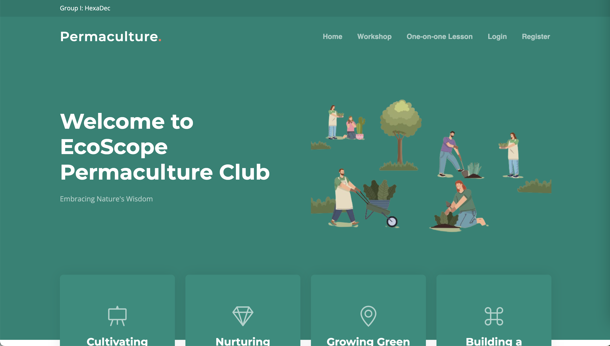
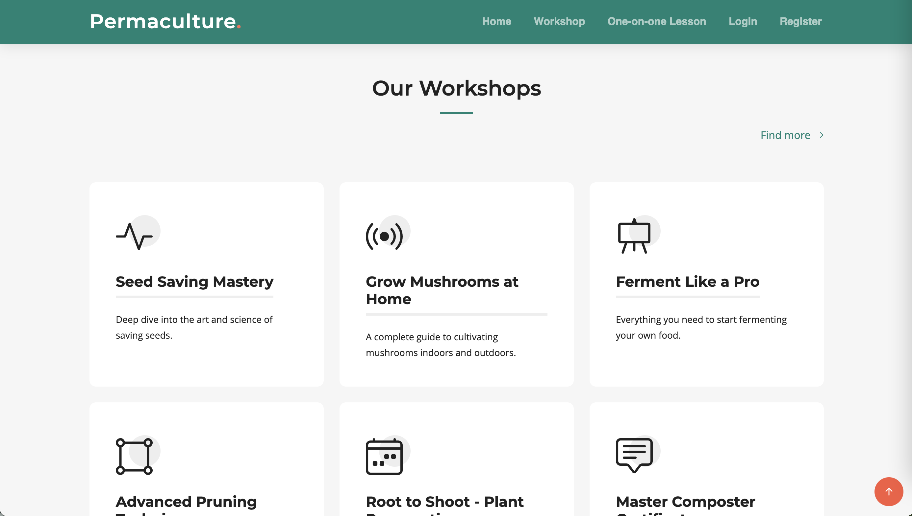
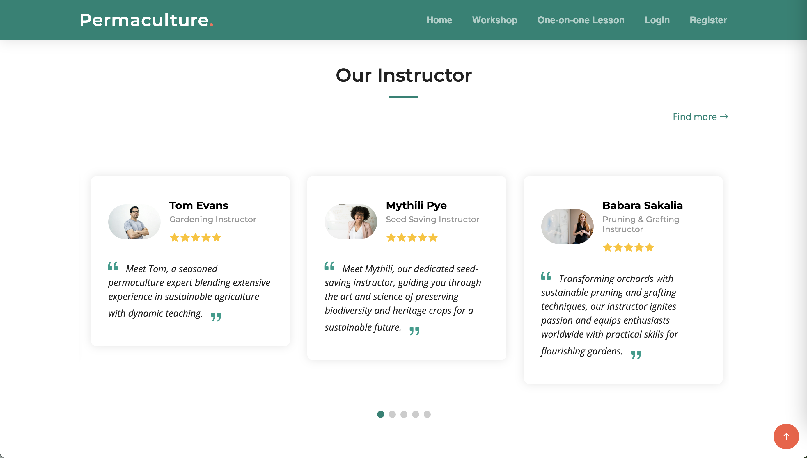
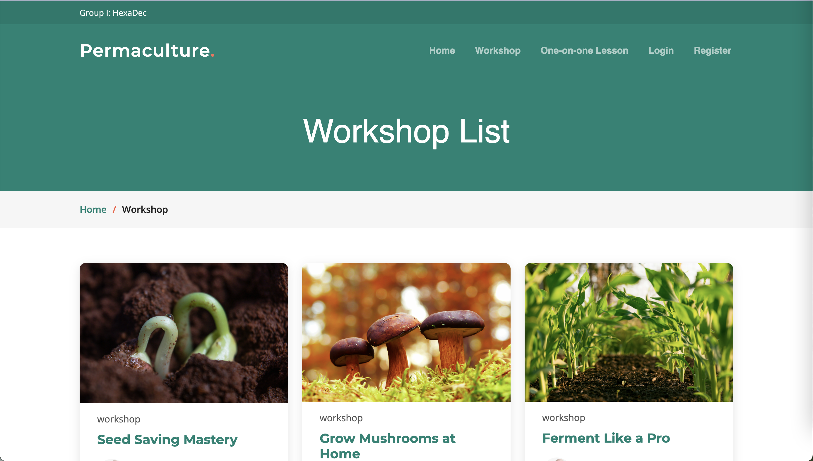

### User Login and Registration:
  - Secure login with password hashing and salting.
  - New member registration with subscription payment options.

### User Roles and Access Control:
 - Member:
   - Manage profile and subscription.
   - View instructors and workshops.
   - Book and manage workshops and one-on-one lessons.
   - View news and receive subscription reminders.
 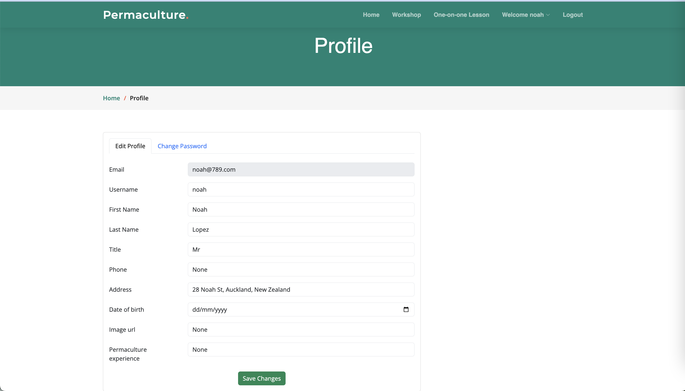
 
 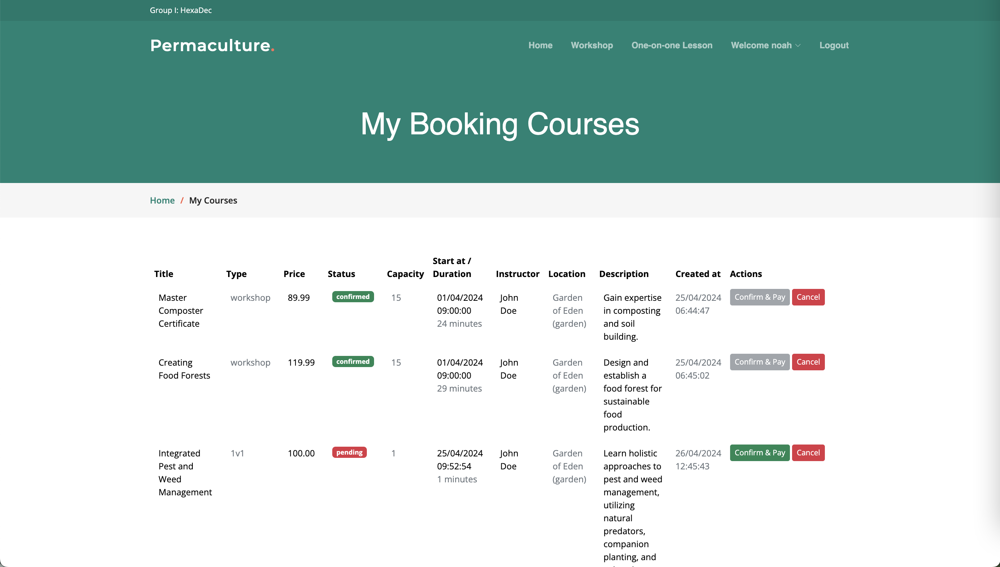
 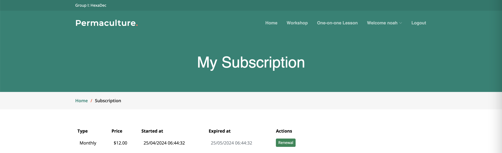

 - Instructor:
   - Manage profile and lesson schedule.
   - View workshop schedule.
   - Record attendance.
   - View member profiles and news.
 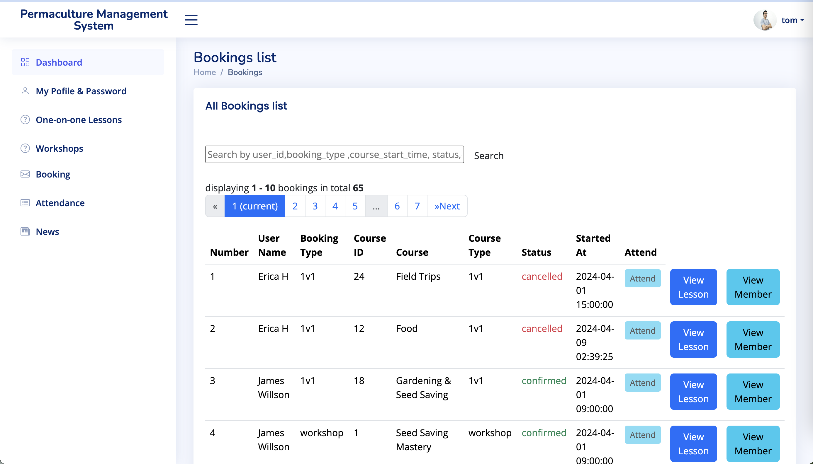

 - Manager:
   - Manage all profiles, schedules, payments, and news.
   - Generate reports on finances, attendance, and workshop popularity.
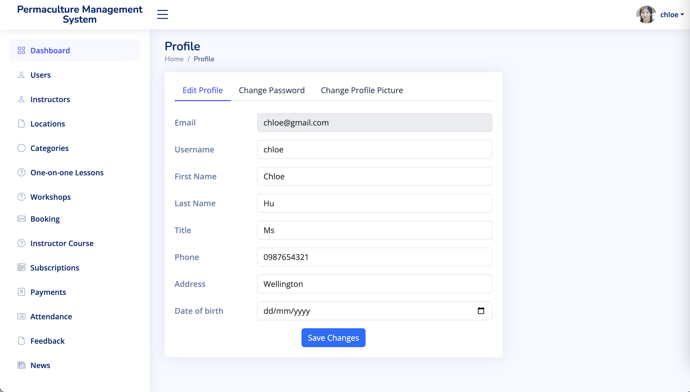
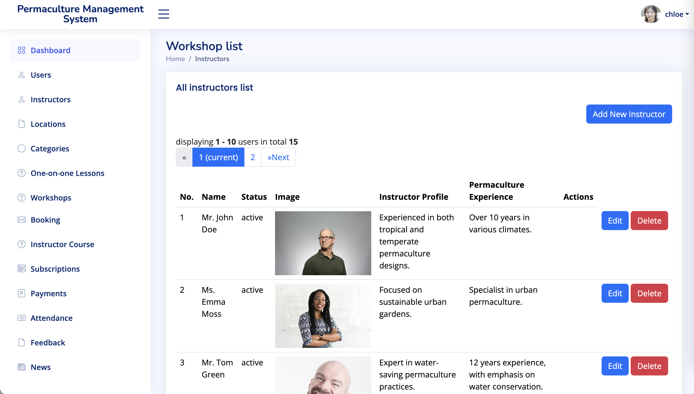
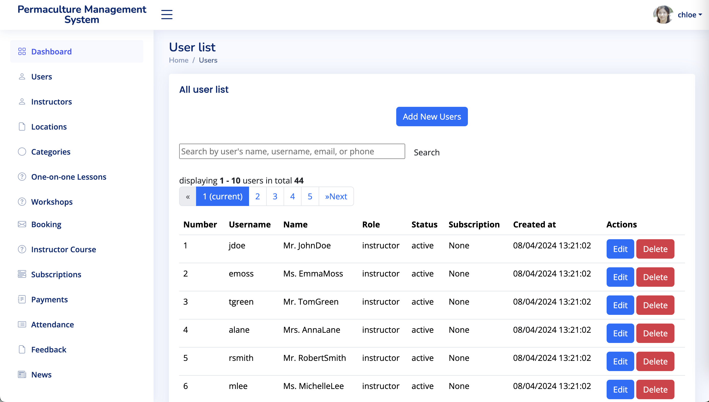
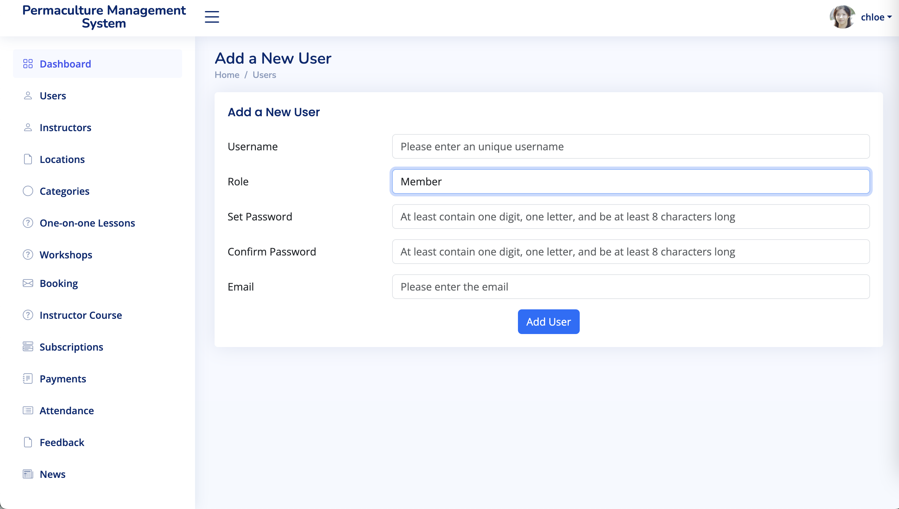
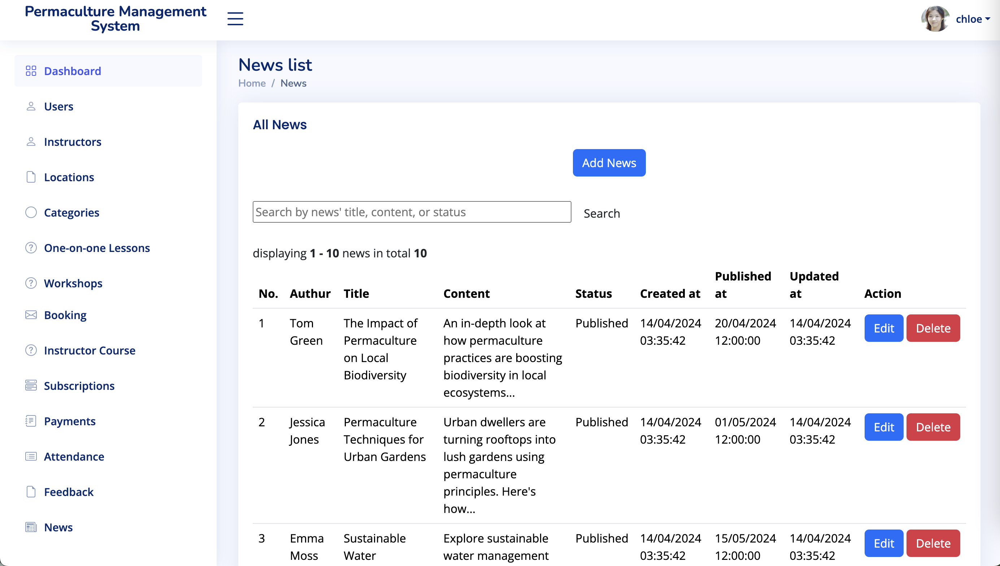

### Dashboard Pages:
Custom dashboards for each user role with tailored functionality.
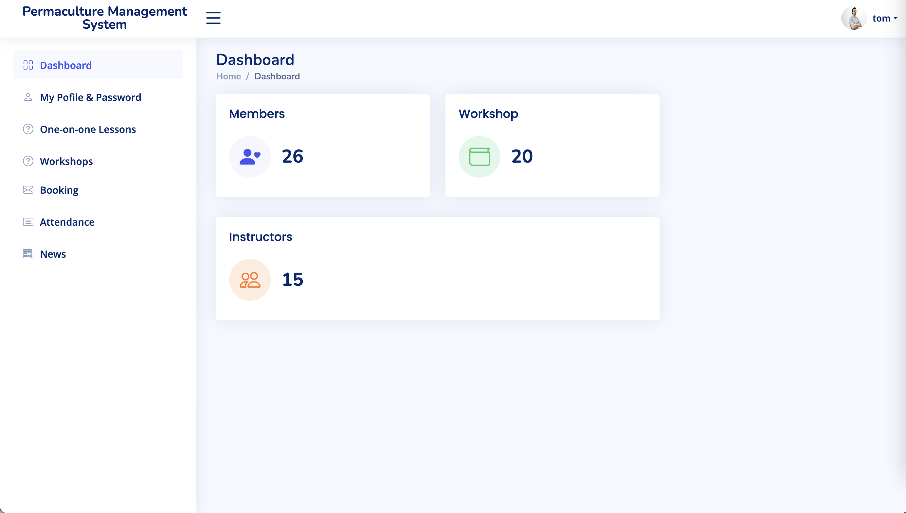
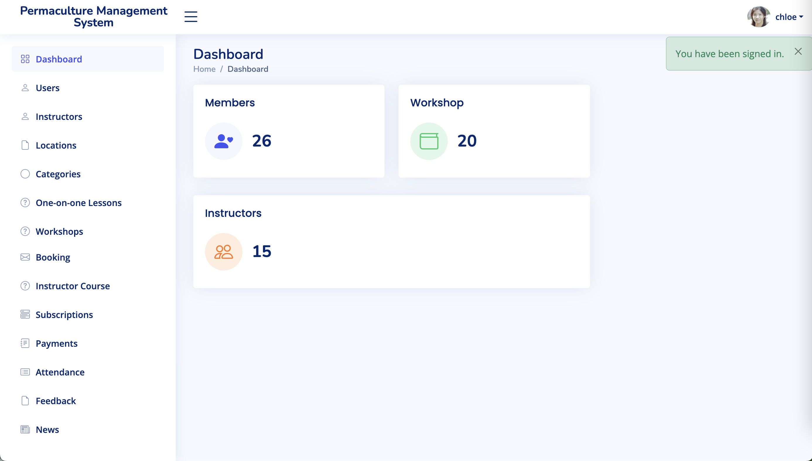

## Data Model
Secure and efficient database schema for managing users, workshops, lessons, payments, and more.
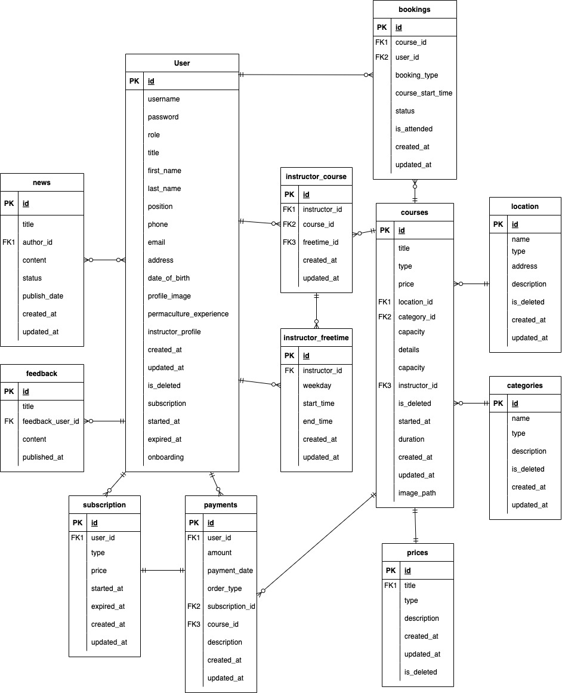

## Project Links
- PythonAnywhere: http://hexadec.pythonanywhere.com/
  _(Note: PythonAnywhere can be a bit slow at times. Please refresh the page if it doesn't load initially.)_
- GitHub: https://github.com/LUMasterOfAppliedComputing2024S1/COMP639S1_Group_I

## Log-in Details:
- Manager: chloe/abcd1234
- Instructor: tom/abcd1234
- Member: noah/abcd1234
